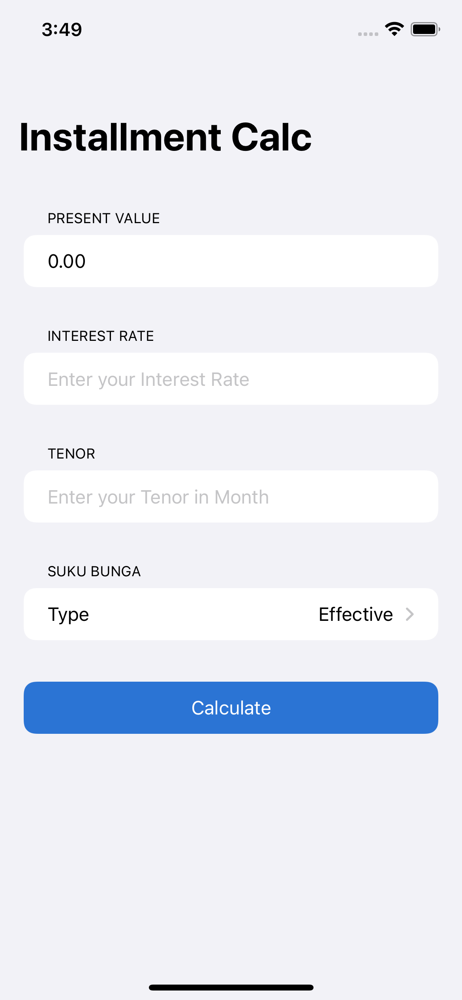
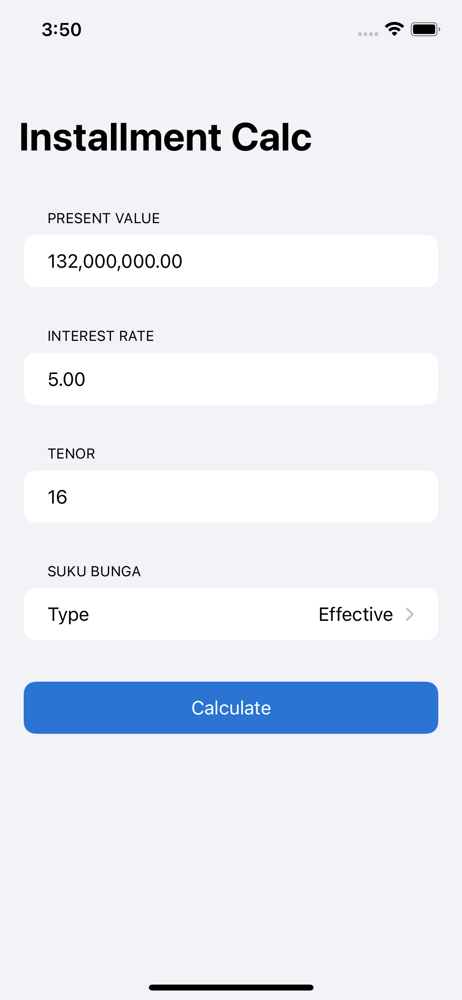
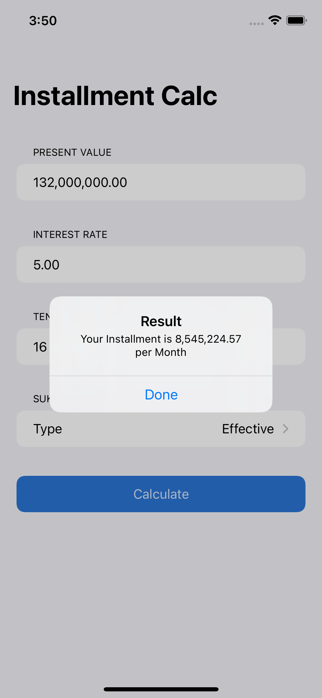

# Installment-Calculator
This app is using for calculate the Installment before Debtor take the Credit 
Framework: SwiftUI

# Screenshots

   
  
  

# Authors
[Candra Winardi](https://github.com/cndrtan) 
Apple Developer Academy @ UC Cohort 2022

# Notes
Nano Challenge 1 at Apple Developer Academy @ UC

# Test
belajar git branch
